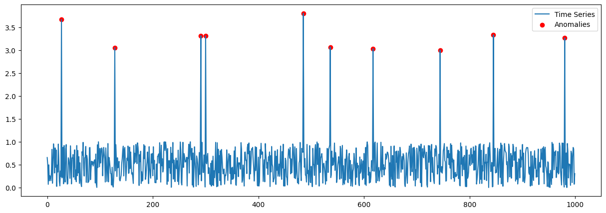
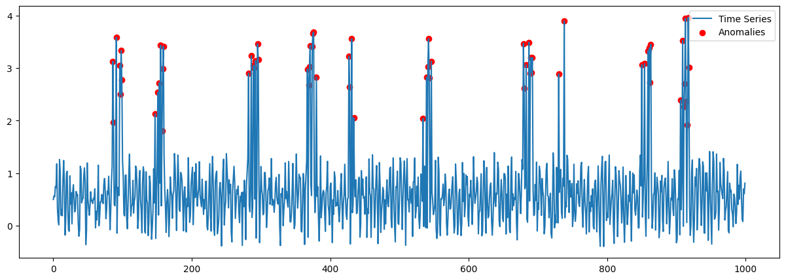

# 시계열 데이터 Benchmark Data 생성기

이 문서는 시계열 데이터와 이상치를 생성하는 `main.py` 스크립트를 실행하는 방법에 대해 설명합니다. 이 스크립트는 정상 범위의 데이터 포인트와 지정된 비율의 이상치를 포함한 시계열 데이터를 생성합니다. 사용자는 사인 파형, 코사인 파형의 추가, 데이터 포인트의 수, 이상치의 비율 및 기울기를 포함한 여러 매개변수를 통해 생성 과정을 사용자 정의할 수 있습니다.

## 필수 조건

스크립트를 실행하기 전에 Python이 시스템에 설치되어 있어야 합니다. 또한 `numpy`, `pandas`, `matplotlib` 라이브러리가 필요합니다. 이 라이브러리들은 다음 명령어를 통해 설치할 수 있습니다:

```bash
pip install numpy pandas matplotlib
```

## 사용법

스크립트는 명령줄 인터페이스(CLI)를 통해 다음과 같이 실행될 수 있습니다:

```bash
python main.py [옵션]
```

사용 가능한 옵션은 다음과 같습니다:

- `--num_points`: 생성할 데이터 포인트의 총 개수입니다. 기본값은 `1000`입니다.
- `--anomaly_rate`: 전체 데이터 포인트 중 이상치의 비율입니다. 기본값은 `0.01`입니다.
- `--normal_range`: 정상 데이터 포인트의 값 범위입니다. 기본값은 `(0, 1)`입니다.
- `--anomaly_range`: 이상치 데이터 포인트의 값 범위입니다. 기본값은 `(2, 3)`입니다.
- `--include_sine`: 사인 파형을 데이터에 포함시킬지 여부입니다. 기본값은 `False`입니다.
- `--include_cosine`: 코사인 파형을 데이터에 포함시킬지 여부입니다. 기본값은 `False`입니다.
- `--anomaly_length`: 이상치가 연속으로 나타나는 길이입니다. 기본값은 `6`입니다.
- `--additional_anomaly_prob`: 추가 이상치가 발생할 확률입니다. 기본값은 `0.5`입니다.
- `--freq`: 사인/코사인 파형의 주파수입니다. 기본값은 `20`입니다.
- `--amp`: 사인/코사인 파형의 진폭입니다. 기본값은 `0.4`입니다.
- `--slope`: 데이터의 기울기로, 시계열의 경향성을 결정합니다. 기본값은 `0`입니다.

예를 들어, default 환경으로 시계열 데이터를 생성하려면 다음 명령어를 사용합니다:
```bash
python main.py
```

예를 들어, 500개의 데이터 포인트, 0.02의 이상치 비율, 사인 파형을 포함하고, 기울기가 0.01인 시계열 데이터를 생성하려면 다음 명령어를 사용합니다:

```bash
python main.py --num_points 500 --anomaly_rate 0.02 --include_sine True --slope 0.01
```

## 결과

스크립트를 실행하면 `./Result` 디렉토리에 시계열 데이터가 포함된 CSV 파일과 생성된 데이터의 시각화를 나타내는 PNG 이미지가 저장됩니다. 파일 이름은 스크립트가 실행된 날짜와 시간에 따라 결정됩니다.

예시 결과 1. 일반 노이즈 기반 시계열 생성


예시 결과 2. SINE/COSE 노이즈 포함 시계열 생성


예시 결과 3. SINE/COSE 노이즈 + 기울기(0.01) 포함 시계열 생성
_시계열.png)

예시 결과 4. SINE/COSE 노이즈 + 기울기(-0.01) 포함 시계열 생성
_시계열.png)
